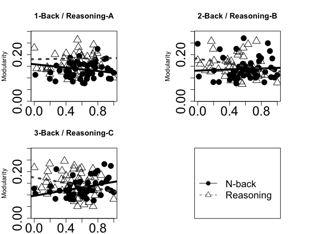
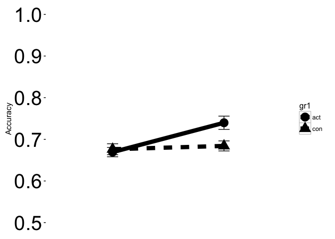
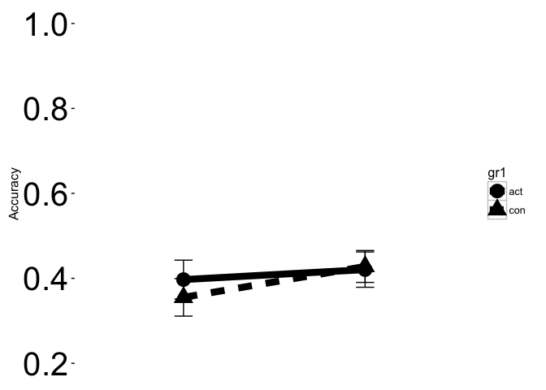
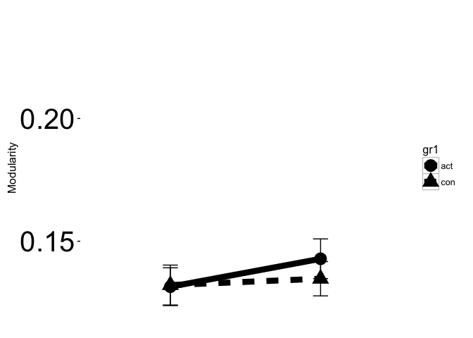
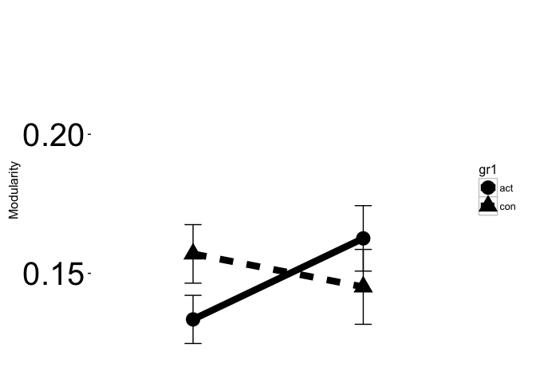
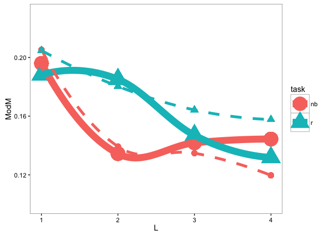

Description
-----------

The script describes and runs main analytical and plotting steps from Lebedev et al., 2017

I. Preparation
--------------

``` r
# Clear workspace:
rm(list=ls())

# Load necessary libraries:
library(ggplot2)
library(nlme)

# Scaling function:
range01 <- function(x){(x-min(x))/(max(x)-min(x))}

# Load the data
load('RBTI-modularity-data.rda')

# Generate performance clasees based on median splits (for plotting)
ddd$NBclass <- rep(ddd$TOTperf [ddd$task=='nb' & ddd$visit==1 & ddd$L==1]>median(ddd$TOTperf [ddd$task=='nb' & ddd$visit==1 & ddd$L==1]),12)
ddd$Rclass <- rep(ddd$TOTperf [ddd$task=='r' & ddd$visit==1 & ddd$L==1]>median(ddd$TOTperf [ddd$task=='r' & ddd$visit==1 & ddd$L==1]),12)

# Select subsets for specific analyses and plotting
dddSnb <- subset(ddd, ddd$task=='nb' & ddd$visit ==1)
dddSr <- subset(ddd, ddd$task=='r' & ddd$visit ==1)
dddV1c <- subset(ddd, ddd$visit ==1)
dddV2c <- subset(ddd, ddd$visit ==2)
dddSnbV12 <- subset(ddd, ddd$task=='nb')
dddSrV12 <- subset(ddd, ddd$task=='r')

# Difference with fixation blocks:
t.test(Qr_fix_v1,
       apply(cbind(subset(dddSr$Qcor, dddSr$L==1),
                   subset(dddSr$Qcor, dddSr$L==2),
                   subset(dddSr$Qcor, dddSr$L==3)),1,mean), paired=T)
```

    ## 
    ##  Paired t-test
    ## 
    ## data:  Qr_fix_v1 and apply(cbind(subset(dddSr$Qcor, dddSr$L == 1), subset(dddSr$Qcor, Qr_fix_v1 and     dddSr$L == 2), subset(dddSr$Qcor, dddSr$L == 3)), 1, mean)
    ## t = 5.22, df = 52, p-value = 3.175e-06
    ## alternative hypothesis: true difference in means is not equal to 0
    ## 95 percent confidence interval:
    ##  0.02187981 0.04920653
    ## sample estimates:
    ## mean of the differences 
    ##              0.03554317

``` r
t.test(Qnb_fix_v1,
       apply(cbind(subset(dddSnb$Qcor, dddSnb$L==1),
                   subset(dddSnb$Qcor, dddSnb$L==2),
                   subset(dddSnb$Qcor, dddSnb$L==3)),1,mean), paired=T)
```

    ## 
    ##  Paired t-test
    ## 
    ## data:  Qnb_fix_v1 and apply(cbind(subset(dddSnb$Qcor, dddSnb$L == 1), subset(dddSnb$Qcor, Qnb_fix_v1 and     dddSnb$L == 2), subset(dddSnb$Qcor, dddSnb$L == 3)), 1, mean)
    ## t = 7.0021, df = 52, p-value = 4.91e-09
    ## alternative hypothesis: true difference in means is not equal to 0
    ## 95 percent confidence interval:
    ##  0.04640604 0.08368801
    ## sample estimates:
    ## mean of the differences 
    ##              0.06504703

II. Estimate final contrasts
----------------------------

``` r
# BL: L, Load x Task, Task x Load x TOTperformance
modME <- lme(Qcor~L*task*TOTperf,data=dddV1c, random=~1|subj)
summary(modME)
```

    ## Linear mixed-effects model fit by REML
    ##  Data: dddV1c 
    ##         AIC       BIC   logLik
    ##   -930.6153 -893.2496 475.3076
    ## 
    ## Random effects:
    ##  Formula: ~1 | subj
    ##         (Intercept)   Residual
    ## StdDev:  0.03142221 0.04445965
    ## 
    ## Fixed effects: Qcor ~ L * task * TOTperf 
    ##                      Value  Std.Error  DF   t-value p-value
    ## (Intercept)      0.4227319 0.14150834 258  2.987328  0.0031
    ## L               -0.1638313 0.06262196 258 -2.616196  0.0094
    ## taskr           -0.2499319 0.14542297 258 -1.718655  0.0869
    ## TOTperf         -0.1175227 0.05882147 258 -1.997955  0.0468
    ## L:taskr          0.1731740 0.06504977 258  2.662176  0.0083
    ## L:TOTperf        0.0672181 0.02603719 258  2.581618  0.0104
    ## taskr:TOTperf    0.1314942 0.06157495 258  2.135514  0.0337
    ## L:taskr:TOTperf -0.0823443 0.02760106 258 -2.983374  0.0031
    ##  Correlation: 
    ##                 (Intr) L      taskr  TOTprf L:tskr L:TOTp ts:TOT
    ## L               -0.885                                          
    ## taskr           -0.962  0.861                                   
    ## TOTperf         -0.997  0.883  0.960                            
    ## L:taskr          0.852 -0.963 -0.895 -0.850                     
    ## L:TOTperf        0.883 -0.998 -0.859 -0.885  0.960              
    ## taskr:TOTperf    0.939 -0.844 -0.993 -0.942  0.890  0.846       
    ## L:taskr:TOTperf -0.833  0.941  0.888  0.835 -0.993 -0.943 -0.897
    ## 
    ## Standardized Within-Group Residuals:
    ##        Min         Q1        Med         Q3        Max 
    ## -2.1663280 -0.5828165 -0.1319339  0.3909882  4.8695019 
    ## 
    ## Number of Observations: 318
    ## Number of Groups: 53

``` r
# Group x visit:
modME <- lme(Qcor~gr*visit,data=ddd, random=~1|subj)
summary(modME)
```

    ## Linear mixed-effects model fit by REML
    ##  Data: ddd 
    ##         AIC       BIC   logLik
    ##   -1802.681 -1775.988 907.3405
    ## 
    ## Random effects:
    ##  Formula: ~1 | subj
    ##         (Intercept)   Residual
    ## StdDev:  0.02761039 0.05347516
    ## 
    ## Fixed effects: Qcor ~ gr * visit 
    ##                    Value   Std.Error  DF   t-value p-value
    ## (Intercept)   0.16984971 0.010998825 581 15.442532  0.0000
    ## gr1.00       -0.04839907 0.015409989  51 -3.140760  0.0028
    ## visit        -0.01188971 0.006054870 581 -1.963661  0.0500
    ## gr1.00:visit  0.02962895 0.008483223 581  3.492653  0.0005
    ##  Correlation: 
    ##              (Intr) gr1.00 visit 
    ## gr1.00       -0.714              
    ## visit        -0.826  0.589       
    ## gr1.00:visit  0.589 -0.826 -0.714
    ## 
    ## Standardized Within-Group Residuals:
    ##        Min         Q1        Med         Q3        Max 
    ## -2.9125659 -0.6306972 -0.1253284  0.3858989  6.0377197 
    ## 
    ## Number of Observations: 636
    ## Number of Groups: 53

``` r
# Task x group x visit:
modME <- lme(Qcor~L*task*gr*visit,data=ddd, random=~1|subj)
summary(modME)
```

    ## Linear mixed-effects model fit by REML
    ##  Data: ddd 
    ##         AIC       BIC   logLik
    ##   -1754.074 -1674.339 895.0369
    ## 
    ## Random effects:
    ##  Formula: ~1 | subj
    ##         (Intercept)   Residual
    ## StdDev:  0.02802624 0.05081292
    ## 
    ## Fixed effects: Qcor ~ L * task * gr * visit 
    ##                            Value  Std.Error  DF   t-value p-value
    ## (Intercept)           0.14866326 0.03447867 569  4.311746  0.0000
    ## L                    -0.00463359 0.01575642 569 -0.294076  0.7688
    ## taskr                 0.13277219 0.04813665 569  2.758235  0.0060
    ## gr1.00               -0.00371552 0.04830661  51 -0.076915  0.9390
    ## visit                -0.00265917 0.02152736 569 -0.123525  0.9017
    ## L:taskr              -0.03593247 0.02228294 569 -1.612555  0.1074
    ## L:gr1.00             -0.00467358 0.02207565 569 -0.211707  0.8324
    ## taskr:gr1.00         -0.14426213 0.06744222 569 -2.139048  0.0329
    ## L:visit               0.00068618 0.00996523 569  0.068857  0.9451
    ## taskr:visit          -0.04875425 0.03044429 569 -1.601425  0.1098
    ## gr1.00:visit         -0.00659544 0.03016108 569 -0.218674  0.8270
    ## L:taskr:gr1.00        0.03679466 0.03121968 569  1.178573  0.2391
    ## L:taskr:visit         0.01377423 0.01409297 569  0.977383  0.3288
    ## L:gr1.00:visit        0.00741628 0.01396187 569  0.531181  0.5955
    ## taskr:gr1.00:visit    0.09335762 0.04265421 569  2.188708  0.0290
    ## L:taskr:gr1.00:visit -0.02528698 0.01974506 569 -1.280673  0.2008
    ##  Correlation: 
    ##                      (Intr) L      taskr  gr1.00 visit  L:tskr L:g1.00
    ## L                    -0.914                                           
    ## taskr                -0.698  0.655                                    
    ## gr1.00               -0.714  0.652  0.498                             
    ## visit                -0.937  0.878  0.671  0.668                      
    ## L:taskr               0.646 -0.707 -0.926 -0.461 -0.621               
    ## L:gr1.00              0.652 -0.714 -0.467 -0.914 -0.627  0.505        
    ## taskr:gr1.00          0.498 -0.467 -0.714 -0.698 -0.479  0.661  0.655 
    ## L:visit               0.867 -0.949 -0.621 -0.619 -0.926  0.671  0.677 
    ## taskr:visit           0.662 -0.621 -0.949 -0.473 -0.707  0.878  0.443 
    ## gr1.00:visit          0.668 -0.627 -0.479 -0.937 -0.714  0.443  0.878 
    ## L:taskr:gr1.00       -0.461  0.505  0.661  0.646  0.443 -0.714 -0.707 
    ## L:taskr:visit        -0.613  0.671  0.878  0.438  0.655 -0.949 -0.479 
    ## L:gr1.00:visit       -0.619  0.677  0.443  0.867  0.661 -0.479 -0.949 
    ## taskr:gr1.00:visit   -0.473  0.443  0.677  0.662  0.505 -0.627 -0.621 
    ## L:taskr:gr1.00:visit  0.438 -0.479 -0.627 -0.613 -0.467  0.677  0.671 
    ##                      ts:1.00 L:vist tskr:v g1.00: L:t:1.00 L:tsk: L:1.00:
    ## L                                                                        
    ## taskr                                                                    
    ## gr1.00                                                                   
    ## visit                                                                    
    ## L:taskr                                                                  
    ## L:gr1.00                                                                 
    ## taskr:gr1.00                                                             
    ## L:visit               0.443                                              
    ## taskr:visit           0.677   0.655                                      
    ## gr1.00:visit          0.671   0.661  0.505                               
    ## L:taskr:gr1.00       -0.926  -0.479 -0.627 -0.621                        
    ## L:taskr:visit        -0.627  -0.707 -0.926 -0.467  0.677                 
    ## L:gr1.00:visit       -0.621  -0.714 -0.467 -0.926  0.671    0.505        
    ## taskr:gr1.00:visit   -0.949  -0.467 -0.714 -0.707  0.878    0.661  0.655 
    ## L:taskr:gr1.00:visit  0.878   0.505  0.661  0.655 -0.949   -0.714 -0.707 
    ##                      t:1.00:
    ## L                           
    ## taskr                       
    ## gr1.00                      
    ## visit                       
    ## L:taskr                     
    ## L:gr1.00                    
    ## taskr:gr1.00                
    ## L:visit                     
    ## taskr:visit                 
    ## gr1.00:visit                
    ## L:taskr:gr1.00              
    ## L:taskr:visit               
    ## L:gr1.00:visit              
    ## taskr:gr1.00:visit          
    ## L:taskr:gr1.00:visit -0.926 
    ## 
    ## Standardized Within-Group Residuals:
    ##        Min         Q1        Med         Q3        Max 
    ## -3.4993067 -0.5571181 -0.1225292  0.3982480  5.9159176 
    ## 
    ## Number of Observations: 636
    ## Number of Groups: 53

``` r
#  Group x visit: > in reasoning:
modME <- lme(Qcor~L*gr*visit,data=dddSrV12, random=~1|subj)
summary(modME)
```

    ## Linear mixed-effects model fit by REML
    ##  Data: dddSrV12 
    ##         AIC       BIC   logLik
    ##   -754.1406 -716.7749 387.0703
    ## 
    ## Random effects:
    ##  Formula: ~1 | subj
    ##         (Intercept)   Residual
    ## StdDev:  0.03497769 0.06003921
    ## 
    ## Fixed effects: Qcor ~ L * gr * visit 
    ##                      Value  Std.Error  DF   t-value p-value
    ## (Intercept)     0.28143545 0.04079892 259  6.898110  0.0000
    ## L              -0.04056606 0.01861737 259 -2.178936  0.0302
    ## gr1.00         -0.14797764 0.05716165  51 -2.588757  0.0125
    ## visit          -0.05141342 0.02543617 259 -2.021272  0.0443
    ## L:gr1.00        0.03212109 0.02608401 259  1.231447  0.2193
    ## L:visit         0.01446041 0.01177466 259  1.228096  0.2205
    ## gr1.00:visit    0.08676218 0.03563754 259  2.434572  0.0156
    ## L:gr1.00:visit -0.01787070 0.01649698 259 -1.083271  0.2797
    ##  Correlation: 
    ##                (Intr) L      gr1.00 visit  L:g1.00 L:vist g1.00:
    ## L              -0.913                                           
    ## gr1.00         -0.714  0.651                                    
    ## visit          -0.935  0.878  0.667                             
    ## L:gr1.00        0.651 -0.714 -0.913 -0.627                      
    ## L:visit         0.866 -0.949 -0.618 -0.926  0.677               
    ## gr1.00:visit    0.667 -0.627 -0.935 -0.714  0.878   0.661       
    ## L:gr1.00:visit -0.618  0.677  0.866  0.661 -0.949  -0.714 -0.926
    ## 
    ## Standardized Within-Group Residuals:
    ##        Min         Q1        Med         Q3        Max 
    ## -2.5278891 -0.5597774 -0.1329963  0.3892357  4.8818886 
    ## 
    ## Number of Observations: 318
    ## Number of Groups: 53

``` r
# in separate groups:
ddd_act<- subset(ddd, ddd$gr=='1.00')
ddd_con<- subset(ddd, ddd$gr=='0.00')

modME <- lme(Qcor~L*task*visit,data=ddd_act, random=~1|subj)
summary(modME)
```

    ## Linear mixed-effects model fit by REML
    ##  Data: ddd_act 
    ##         AIC       BIC   logLik
    ##   -952.8881 -915.3307 486.4441
    ## 
    ## Random effects:
    ##  Formula: ~1 | subj
    ##         (Intercept)   Residual
    ## StdDev:   0.0254147 0.04621665
    ## 
    ## Fixed effects: Qcor ~ L * task * visit 
    ##                     Value  Std.Error  DF   t-value p-value
    ## (Intercept)    0.14494774 0.03077136 290  4.710476  0.0000
    ## L             -0.00930716 0.01406328 290 -0.661806  0.5086
    ## taskr         -0.01148994 0.04296403 290 -0.267432  0.7893
    ## visit         -0.00925461 0.01921410 290 -0.481657  0.6304
    ## L:taskr        0.00086219 0.01988848 290  0.043351  0.9655
    ## L:visit        0.00810246 0.00889440 290  0.910962  0.3631
    ## taskr:visit    0.04460337 0.02717284 290  1.641469  0.1018
    ## L:taskr:visit -0.01151275 0.01257858 290 -0.915266  0.3608
    ##  Correlation: 
    ##               (Intr) L      taskr  visit  L:tskr L:vist tskr:v
    ## L             -0.914                                          
    ## taskr         -0.698  0.655                                   
    ## visit         -0.937  0.878  0.671                            
    ## L:taskr        0.646 -0.707 -0.926 -0.621                     
    ## L:visit        0.867 -0.949 -0.621 -0.926  0.671              
    ## taskr:visit    0.662 -0.621 -0.949 -0.707  0.878  0.655       
    ## L:taskr:visit -0.613  0.671  0.878  0.655 -0.949 -0.707 -0.926
    ## 
    ## Standardized Within-Group Residuals:
    ##        Min         Q1        Med         Q3        Max 
    ## -1.8521746 -0.5797068 -0.1135398  0.4178148  5.9782638 
    ## 
    ## Number of Observations: 324
    ## Number of Groups: 27

III. Plot
---------

#### III.1 Performance x Moduarity:

``` r
par(mfrow=c(2,2),mar=c(2, 4, 4, 6))
rlab <- c('A', 'B', 'C')

for (i in 1:3) {
  l=i
  totperf <- range01(dddSnb$TOTperf[dddSnb$L==l])
  mod <- dddSnb$Qcor[dddSnb$L==l]
  plot(totperf, mod, col=1, pch=16,cex=2,ylim=c(0.01,0.29),cex.axis=2,
       xlab='Acc',ylab='Modularity', main=paste(i,'-Back / Reasoning-', rlab[i], sep=''))
  abline(glm(mod~totperf), col='black', lty=1, lwd=4)
  cor(totperf, mod)
  totperf <- range01(dddSr$TOTperf[dddSr$L==l])
  mod <- dddSr$Qcor[dddSr$L==l]
  points(totperf, mod, col='black', pch=2,cex=2,ylim=c(0.01,0.29))
  abline(glm(mod~totperf), col='gray31', lty=3, lwd=4)
  cor(totperf, mod)}

totperf <- range01(dddSnb$TOTperf[dddSnb$L==l])
mod <- dddSnb$Qcor[dddSnb$L==l]
plot(totperf, mod, col=1, pch=16,type='n', cex=4,ylim=c(0.01,0.29),cex.axis=2,
     xlab='',ylab='', yaxt='n',xaxt='n')
legend(-0.01, 0.2, c('N-back', 'Reasoning'), col = c('Black', 'gray31'),
       text.col = "black", lty = c(1, 2), pch = c(16,2), cex=1.5,
       merge = TRUE, bg = "white", border = 'white', bty = 'n')
```



#### III.2 Change in performance :

N-back:

``` r
l=3 # do for each l {1, 2, 3}
dat <- as.data.frame(subset(ddd[,c('subj', 'perf', 'visit', 'gr')], 
                            ddd$task=='nb' & ddd$L==l))
dat$subj <- as.factor(dat$subj)
dat$gr <- as.factor(dat$gr)
dat$gr1[dat$gr=='0.00'] <- 'con'
dat$gr1[dat$gr=='1.00'] <- 'act'
dat$gr1 <- as.factor(dat$gr1)
dat$visit <- as.factor(dat$visit)


df <- aggregate(perf~visit+gr1, data=dat, mean)
df$se <- aggregate(perf~visit+gr1, data=dat, sd)[,3]/as.numeric(c(sqrt(27),sqrt(27),sqrt(25),sqrt(25)))
gp <- ggplot(data=df, aes(x=visit, y=perf, group=gr1))

gp + geom_line(aes(linetype=gr1), size=3)+theme_bw() +
  theme(axis.text=element_text(size=30), axis.title.x=element_blank(),
        panel.grid.major = element_blank(), panel.grid.minor = element_blank(),
        panel.border = element_blank(),axis.text.x=element_blank(), axis.ticks.x=element_blank()) +
  geom_point(aes(shape=gr1), size=6) +
  geom_errorbar(aes(ymax=perf+se, ymin=perf-se),width=.1) +
  scale_y_continuous(limits = c(0.5, 1))+ylab("Accuracy")
```



Reasoning:

``` r
l=3 # do for each l {1, 2, 3}
dat <- as.data.frame(subset(ddd[,c('subj', 'perf', 'visit', 'gr')], 
                            ddd$task=='r' & ddd$L==l))
dat$subj <- as.factor(dat$subj)
dat$gr <- as.factor(dat$gr)
dat$gr1[dat$gr=='0.00'] <- 'con'
dat$gr1[dat$gr=='1.00'] <- 'act'
dat$gr1 <- as.factor(dat$gr1)
dat$visit <- as.factor(dat$visit)

df <- aggregate(perf~visit+gr1, data=dat, mean)
df$se <- aggregate(perf~visit+gr1, data=dat, sd)[,3]/as.numeric(c(sqrt(27),sqrt(27),sqrt(25),sqrt(25)))
gp <- ggplot(data=df, aes(x=visit, y=perf, group=gr1))

gp + geom_line(aes(linetype=gr1), size=3)+theme_bw() +
  theme(axis.text=element_text(size=30), axis.title.x=element_blank(),
        panel.grid.major = element_blank(), panel.grid.minor = element_blank(),
        panel.border = element_blank(),axis.text.x=element_blank(), axis.ticks.x=element_blank())  +
  geom_point(aes(shape=gr1), size=6) +
  geom_errorbar(aes(ymax=perf+se, ymin=perf-se),width=.1) +
  scale_y_continuous(limits = c(0.2, 1))+ylab("Accuracy")
```



#### III.3 Modularity change:

N-back:

``` r
l=3
dat <- as.data.frame(subset(ddd[,c('subj', 'Qcor', 'visit', 'gr')], 
                            ddd$task=='nb' & ddd$L==l))
dat$subj <- as.factor(dat$subj)
dat$gr <- as.factor(dat$gr)
dat$visit <- as.factor(dat$visit)
dat$gr1[dat$gr=='0.00'] <- 'con'
dat$gr1[dat$gr=='1.00'] <- 'act'
dat$gr1 <- as.factor(dat$gr1)

df <- aggregate(Qcor~visit+gr1, data=dat, mean)
df$se <- aggregate(Qcor~visit+gr1, data=dat, sd)[,3]/as.numeric(c(sqrt(27),sqrt(27),sqrt(25),sqrt(25)))
gp <- ggplot(data=df, aes(x=visit, y=Qcor, group=gr1))

gp + geom_line(aes(linetype=gr1), size=3) + geom_point(aes(shape=gr1), size=6) + theme_bw() +
  theme(axis.text=element_text(size=30), axis.title.x=element_blank(),
        panel.grid.major = element_blank(), panel.grid.minor = element_blank(),
        panel.border = element_blank(),axis.text.x=element_blank(), axis.ticks.x=element_blank())  +
  geom_errorbar(aes(ymax=Qcor+se, ymin=Qcor-se), width=.1) +
  scale_y_continuous(limits = c(0.12, 0.24))+ylab("Modularity")
```



Reasoning:

``` r
l=3
dat <- as.data.frame(subset(ddd[,c('subj', 'Qcor', 'visit', 'gr')], 
                            ddd$task=='r' & ddd$L==l))
dat$subj <- as.factor(dat$subj)
dat$gr <- as.factor(dat$gr)
dat$gr1[dat$gr=='0.00'] <- 'con'
dat$gr1[dat$gr=='1.00'] <- 'act'
dat$gr1 <- as.factor(dat$gr1)
dat$visit <- as.factor(dat$visit)

df <- aggregate(Qcor~visit+gr1, data=dat, mean)
df$se <- aggregate(Qcor~visit+gr1, data=dat, sd)[,3]/as.numeric(c(sqrt(27),sqrt(27),sqrt(25),sqrt(25)))
gp <- ggplot(data=df, aes(x=visit, y=Qcor, group=gr1))

gp + geom_line(aes(linetype=gr1), size=3) + geom_point(aes(shape=gr1), size=6) + theme_bw() +
  theme(axis.text=element_text(size=30), axis.title.x=element_blank(),
        panel.grid.major = element_blank(), panel.grid.minor = element_blank(),
        panel.border = element_blank(),axis.text.x=element_blank(), axis.ticks.x=element_blank())  +
  geom_errorbar(aes(ymax=Qcor+se, ymin=Qcor-se), width=.1) +
  scale_y_continuous(limits = c(0.12, 0.24))+ylab("Modularity")
```



III.4 Final plot (shifts in performance + median splits)

Prepare the data

``` r
# III.4a "Good" performers:
# Uncomment to plot intermediate results
#plot(c(1:4), c(0,0.05,0.1,0.15), type='n')
#points(c(1:4), c(mean(Qnb_fix_v1[ddd$NBclass[1:53]==T]),
#                 mean(subset(dddV1c$Qcor, dddV1c$task=='nb' & dddV1c$L==1 & dddV1c$NBclass==T)),
#                 mean(subset(dddV1c$Qcor, dddV1c$task=='nb' & dddV1c$L==2 & dddV1c$NBclass==T)),
#                 mean(subset(dddV1c$Qcor, dddV1c$task=='nb' & dddV1c$L==3 & dddV1c$NBclass==T))),
#       pch=1, cex=5)

dnb <- as.data.frame(cbind(c(1:4),c(mean(Qnb_fix_v1[ddd$NBclass[1:53]==T]),
                                    mean(subset(dddV1c$Qcor, dddV1c$task=='nb' & dddV1c$L==1 & dddV1c$NBclass==T)),
                                    mean(subset(dddV1c$Qcor, dddV1c$task=='nb' & dddV1c$L==2 & dddV1c$NBclass==T)),
                                    mean(subset(dddV1c$Qcor, dddV1c$task=='nb' & dddV1c$L==3 & dddV1c$NBclass==T)))))

dr <- as.data.frame(cbind(c(1:4),c(mean(Qr_fix_v1[ddd$Rclass[1:53]==T]),
                                   mean(subset(dddV1c$Qcor, dddV1c$task=='r' & dddV1c$L==1 & dddV1c$Rclass==T)),
                                   mean(subset(dddV1c$Qcor, dddV1c$task=='r' & dddV1c$L==2 & dddV1c$Rclass==T)),
                                   mean(subset(dddV1c$Qcor, dddV1c$task=='r' & dddV1c$L==3 & dddV1c$Rclass==T)))))

dm <- rbind(dnb, dr)
dm$task <- c(rep('NB', 4), rep('R', 4))
colnames(dm)[1:2] <- c('L', 'Modularity')


mod1 <- c(Qnb_fix_v1[ddd$NBclass[1:53]==T],
          subset(dddV1c$Qcor, dddV1c$task=='nb' & dddV1c$L==1 & dddV1c$NBclass==T),
          subset(dddV1c$Qcor, dddV1c$task=='nb' & dddV1c$L==2 & dddV1c$NBclass==T),
          subset(dddV1c$Qcor, dddV1c$task=='nb' & dddV1c$L==3 & dddV1c$NBclass==T))
mod2 <- c(Qr_fix_v1[ddd$Rclass[1:53]==T],
          subset(dddV1c$Qcor, dddV1c$task=='r' & dddV1c$L==1 & dddV1c$Rclass==T),
          subset(dddV1c$Qcor, dddV1c$task=='r' & dddV1c$L==2 & dddV1c$Rclass==T),
          subset(dddV1c$Qcor, dddV1c$task=='r' & dddV1c$L==3 & dddV1c$Rclass==T))

L1 <- c(rep(1,length(mod1)/4),rep(2,length(mod1)/4),rep(3,length(mod1)/4),rep(4,length(mod1)/4))
m1 <- cbind(mod1, L1)                                            

L2 <- c(rep(1,length(mod2)/4),rep(2,length(mod2)/4),rep(3,length(mod2)/4),rep(4,length(mod2)/4))
m2 <- cbind(mod2, L1)                                            

d <- as.data.frame(rbind(m1,m2))
d$task <- c(rep('nb', dim(d)[1]/2),rep('r', dim(d)[1]/2))
colnames(d)[1:2] <- c('Modularity', 'L') 

d$ModM[d$task=='nb' & d$L==1] <- dm$Modularity[dm$task=='NB' & dm$L==1]
d$ModM[d$task=='nb' & d$L==2] <- dm$Modularity[dm$task=='NB' & dm$L==2]
d$ModM[d$task=='nb' & d$L==3] <- dm$Modularity[dm$task=='NB' & dm$L==3]
d$ModM[d$task=='nb' & d$L==4] <- dm$Modularity[dm$task=='NB' & dm$L==4]
d$ModM[d$task=='r' & d$L==1] <- dm$Modularity[dm$task=='R' & dm$L==1]
d$ModM[d$task=='r' & d$L==2] <- dm$Modularity[dm$task=='R' & dm$L==2]
d$ModM[d$task=='r' & d$L==3] <- dm$Modularity[dm$task=='R' & dm$L==3]
d$ModM[d$task=='r' & d$L==4] <- dm$Modularity[dm$task=='R' & dm$L==4]


#ggplot(d) + 
#  geom_point(aes(x = L, y = ModM, shape=task), size = 7) +
#  stat_smooth(aes(x = L, y = Modularity, linetype=task, fill=task), method = "loess", se = T, size=3, color=1, span=0.95) +
#  coord_cartesian(ylim = c(0, 0.3)) + 
#  theme_bw()+theme(panel.grid.major = element_blank(), panel.grid.minor = element_blank()) # white background

dT <- d
dT$class <- T


# III.4b "Bad" performers:
#plot(c(1:4), c(0,0.05,0.1,0.15), type='n')
#points(c(1:4), c(mean(Qnb_fix_v1[ddd$NBclass[1:53]==F]),
#                 mean(subset(dddV1c$Qcor, dddV1c$task=='nb' & dddV1c$L==1 & dddV1c$NBclass==F)),
#                 mean(subset(dddV1c$Qcor, dddV1c$task=='nb' & dddV1c$L==2 & dddV1c$NBclass==F)),
#                 mean(subset(dddV1c$Qcor, dddV1c$task=='nb' & dddV1c$L==3 & dddV1c$NBclass==F))),
#       pch=1, cex=5)

dnb <- as.data.frame(cbind(c(1:4),c(mean(Qnb_fix_v1[ddd$NBclass[1:53]==F]),
                                    mean(subset(dddV1c$Qcor, dddV1c$task=='nb' & dddV1c$L==1 & dddV1c$NBclass==F)),
                                    mean(subset(dddV1c$Qcor, dddV1c$task=='nb' & dddV1c$L==2 & dddV1c$NBclass==F)),
                                    mean(subset(dddV1c$Qcor, dddV1c$task=='nb' & dddV1c$L==3 & dddV1c$NBclass==F)))))

dr <- as.data.frame(cbind(c(1:4),c(mean(Qr_fix_v1[ddd$Rclass[1:53]==F]),
                                   mean(subset(dddV1c$Qcor, dddV1c$task=='r' & dddV1c$L==1 & dddV1c$Rclass==F)),
                                   mean(subset(dddV1c$Qcor, dddV1c$task=='r' & dddV1c$L==2 & dddV1c$Rclass==F)),
                                   mean(subset(dddV1c$Qcor, dddV1c$task=='r' & dddV1c$L==3 & dddV1c$Rclass==F)))))

dm <- rbind(dnb, dr)
dm$task <- c(rep('NB', 4), rep('R', 4))
colnames(dm)[1:2] <- c('L', 'Modularity')
# Final plot:
mod1 <- c(Qnb_fix_v1[ddd$NBclass[1:53]==F],
          subset(dddV1c$Qcor, dddV1c$task=='nb' & dddV1c$L==1 & dddV1c$NBclass==F),
          subset(dddV1c$Qcor, dddV1c$task=='nb' & dddV1c$L==2 & dddV1c$NBclass==F),
          subset(dddV1c$Qcor, dddV1c$task=='nb' & dddV1c$L==3 & dddV1c$NBclass==F))
mod2 <- c(Qr_fix_v1[ddd$Rclass[1:53]==F],
          subset(dddV1c$Qcor, dddV1c$task=='r' & dddV1c$L==1 & dddV1c$Rclass==F),
          subset(dddV1c$Qcor, dddV1c$task=='r' & dddV1c$L==2 & dddV1c$Rclass==F),
          subset(dddV1c$Qcor, dddV1c$task=='r' & dddV1c$L==3 & dddV1c$Rclass==F))

L1 <- c(rep(1,length(mod1)/4),rep(2,length(mod1)/4),rep(3,length(mod1)/4),rep(4,length(mod1)/4))
m1 <- cbind(mod1, L1)                                            

L2 <- c(rep(1,length(mod2)/4),rep(2,length(mod2)/4),rep(3,length(mod2)/4),rep(4,length(mod2)/4))
m2 <- cbind(mod2, L1)                                            

d <- as.data.frame(rbind(m1,m2))
d$task <- c(rep('nb', dim(d)[1]/2),rep('r', dim(d)[1]/2))
colnames(d)[1:2] <- c('Modularity', 'L') 

d$ModM[d$task=='nb' & d$L==1] <- dm$Modularity[dm$task=='NB' & dm$L==1]
d$ModM[d$task=='nb' & d$L==2] <- dm$Modularity[dm$task=='NB' & dm$L==2]
d$ModM[d$task=='nb' & d$L==3] <- dm$Modularity[dm$task=='NB' & dm$L==3]
d$ModM[d$task=='nb' & d$L==4] <- dm$Modularity[dm$task=='NB' & dm$L==4]
d$ModM[d$task=='r' & d$L==1] <- dm$Modularity[dm$task=='R' & dm$L==1]
d$ModM[d$task=='r' & d$L==2] <- dm$Modularity[dm$task=='R' & dm$L==2]
d$ModM[d$task=='r' & d$L==3] <- dm$Modularity[dm$task=='R' & dm$L==3]
d$ModM[d$task=='r' & d$L==4] <- dm$Modularity[dm$task=='R' & dm$L==4]


#ggplot(d) + 
#  geom_point(aes(x = L, y = ModM, shape=task), size = 7) +
#  stat_smooth(aes(x = L, y = Modularity, linetype=task, fill=task), method = "loess", se = T, size=3, color=1, span=0.95) +
#  coord_cartesian(ylim = c(0, 0.3)) + 
#  theme_bw()+theme(panel.grid.major = element_blank(), panel.grid.minor = element_blank()) # white background


dF <- d
dF$class <- F
```

III.4c Plot both "good" and "bad" performers:

``` r
d <- rbind(dT,dF)
ggplot(d) + 
  geom_point(aes(x = L, y = ModM, shape=task, color=task), size = 10, data=dT) +
  geom_point(aes(x = L, y = ModM, shape=task,color=task), size = 4, data=dF) +
  stat_smooth(aes(x = L, y = Modularity, color=task, method = "loess"), size=5, se=F, span=0.95, data=dT) +
  stat_smooth(aes(x = L, y = Modularity, color=task), linetype=2,method = "loess", se = F, size=2, span=0.95, data=dF) +
  coord_cartesian(ylim = c(0.1, 0.23)) + 
  theme_bw()+theme(panel.grid.major = element_blank(), panel.grid.minor = element_blank()) # white background
  
```

